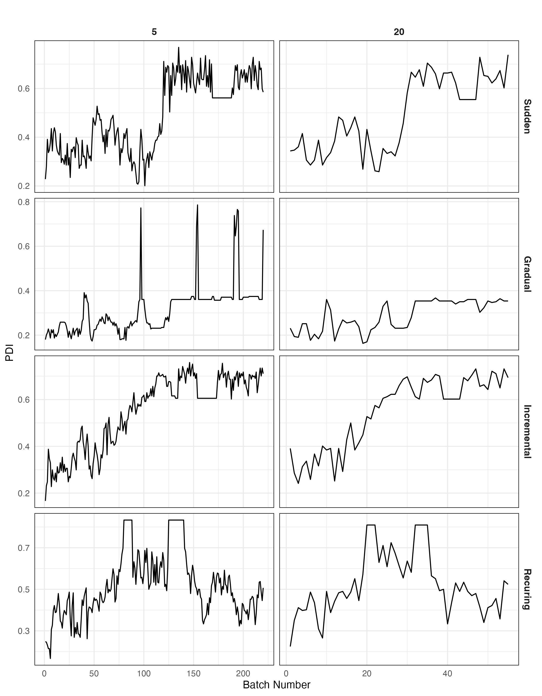

```{r, include=FALSE}
knitr::opts_chunk$set(echo = FALSE,
                      warning = FALSE,
                      tidy = FALSE,
                      message = FALSE,
                      fig.align = 'center',
                      out.width = "100%")
options(knitr.table.format = "html") 
```

```{=html}
<style>
#title {
  font-size: 110pt;
}

#main-img-left {
  width: 20%;
  left: 1in;
  bottom: 1.0in;
}


#main-img-right {
  width: 17%;
  right: 1in;
  bottom: 1.2in;
}

#references {
    font-size: 40px;
    line-height: 0.9;
}

</style>
```
# Introduction

Machine learning (ML) is increasingly being integrated into diverse fields, from healthcare to finance. These applications often involve dynamic production environments where data continuously evolves. This phenomenon, known as **data drift**, can undermine the performance of ML models, leading them to produce misleading results. Data drift arising from these two factors has been classified as virtual concept drift and true concept drift (Celik et al., 2022). **Virtual concept drift** occurs when the distribution of input data changes over time, but the relationship between predictors and the response remains unchanged. **True concept drift** occurs when the actual relationship between the predictors and the response changes. Numerous methods are used to detect data drift. These methods are divided into three groups: statistical, sequential analysis-based, and window-based (Masciopinto, 2019). Demsar and Bosnic (2018) emphasized that existing methods for detecting data drift rely solely on performance and distribution measures, noting that this is insufficient to understand the underlying causes of changes in the model. **EXplainable Artificial Intelligence (XAI)** tools, as showcased by Biecek & Burzykowski (2021), have emerged as promising solutions. Specifically, the **Partial Dependence Profile (PDP)** elucidates how predictors influence model predictions, and the **Profile Disparity Index (PDI)** allows for a comparative analysis of these profiles over time. These tools emphasize the value of understanding and managing data drift in ML models.

Data drift refers to the situation where, even though the relationship between $X$ and $y$ is well modeled at time ${t_0}$ , the model fails to adequately explain the relationship at any time ${t_i}>0$ due to changes in this relationship.

```{=tex}
\begin{equation}
\exists X: P_{t_0}(y \mid X) \neq P_{t_i}(y \mid X), i>0
\end{equation}
```
```{r, include=FALSE}
knitr::write_bib(c('posterdown', 'rmarkdown','pagedown'), 'packages.bib')
```

```{r,figures,fig.cap='Drift Types'}
knitr::include_graphics("drifttypes.png")
```

# Methods

The **partial dependence profile (PDP)** is a XAI tools and calculates the impact of the variables used in the model on the predicted values, based on their marginal distributions (Biecek & Burzykowski, 2021).

In this context, $f()$ represents the trained model, and $x_{\underline{i}}^{j \mid=z}$ indicates the value of the $j$. variable in the state $z$. $$
\hat{g}_{P D}^j(z)=\frac{1}{n} \sum_i^n f\left(\underline{x}_i^{j \mid=z}\right)
$$

Here, $f()$ represents the trained model, and $x_i^{j \mid=z}$ indicates the value of the $j$. variable in the state $z$. The **profile disparity index (PDI)** calculates dissimilarity between two **PDP** based on their shapes (Kobylinska et al., 2023).

```{=tex}
\begin{equation}
\widehat{PDI}(\hat{g}_{f_1}^j, \hat{g}_{f_2}^j) = \frac{1}{m} \sum_{i=1}^{m} I(\text{sgn}(\text{der}(\hat{g}_{f_1}^j)[i]) \neq \text{sgn}(\text{der}(\hat{g}_{f_2}^j)[i]))
\end{equation}
```
Here, $m$ consecutive points of the profile for the $k^{t h}$ model. The term $\operatorname{der}(\hat{g}_{f_1}^k)[i]$ represents the $i^{t h}$ element of the vector derivative for model $f_k$ and predictor $j$. The PDI range is [0,1]: a value of zero indicates identical curves, while a value of one signifies distinctly different curves.

# Simulation Results

For a classification problem, during the simulation, data generated with $X_1\sim N\left(\mu_1, \sigma_1^2\right)$,$X_2\sim N\left(\mu_2, \sigma_2^2\right)$,$\epsilon \sim N\left(\mu_\epsilon, \sigma_\epsilon^2\right)$,$Z=\beta_1 X_1+\beta_2 X_2+\epsilon$, $\pi=\frac{e^z}{1+e^z}$ ,$y\sim Bernoulli (\pi)$. For each simulations these parameters set $\beta_2=-0.5, \mu_2=200, \sigma_2=40, \mu_\epsilon=10, \sigma_\epsilon=5$ and constant. Only $\beta_1$ or $\mu_1$ changed by drift types. These data sets were segmented using various window sizes $(5, 10, 20)$. For sudden drift, $600$ observation generated with $\mu_1=100$ and other $600$ generated with $\mu_1=200$, then for $20$ window size $56$ data sets which have $100$ observations created $[1:100, 20:120, 40:140, …]$.

A model, specifically a random forest, was initially established from the first segmented data $[1:100]$. Subsequent PDPs for the other data sets were derived based on this model. The disparities between these PDPs were quantified using the PDI values and subsequently visualized in Figure \@ref(fig:drift).

```{r,drift,fig.cap='Simulation Results PDI by Drift Types - Random Forest'}

```

# Conclusion

When examining the differences between PDPs for various types of data drift using the PDI metric, it was observed that as the mean of the variable $X_1$ in the data set changes, there is a corresponding increase in the PDI values. This suggests that the alterations in the mean value of $X_1$ have a significant impact on the disparity between the PDPs, highlighting the sensitivity of PDI in capturing these variations.

# References

Celik, B., Singh, P., and Vanschoren, J. 2022. "Online AutoML: An adaptive AutoML framework for online learning". Machine Learning, 1-25.

Kobylińska, K., Krzyziński, M., Machowicz, R., Adamek, M., & Biecek, P. (2023). Exploration of Rashomon Set Assists Explanations for Medical Data. arXiv preprint arXiv:2308.11446.

Biecek, P., Burzykowski, T. 2021. "Explanatory model analysis", Chapman and Hall / CRC Press, ISBN: 9780367135591.

Masciopinto, F. 2019. "Comparison of concept drift detectors in a health-care facility dataset to detect behavioral drifts".

Demšar, J., and Bosnić, Z. 2018. "Detecting concept drift in data streams using model explanation". Expert Systems with Applications, 92, 546-559.

Thorne WB (2019). *posterdown: An R Package Built to Generate Reproducible Conference Posters for the Academic and Professional World Where Powerpoint and Pages Just Won't Cut It*. R package version 1.0, <https://github.com/brentthorne/posterdown>.

#### Acknowledgments Statements

::: {style="line-height: 1;"}
The work on this paper is financially supported by the Scientific and Technological Research Council of Türkiye under the 2210C with grant no. 1649B022303919. Additionally, support was provided by the Eskisehir Technical University Scientific Research Projects Commission under grant no. 22LÖT175.
:::
