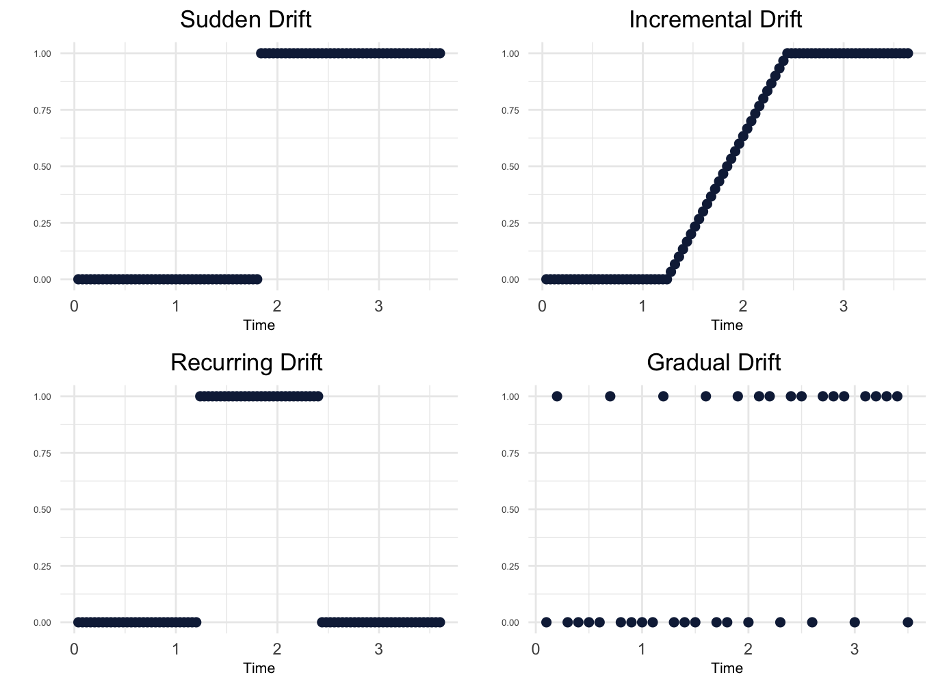

```{r, include=FALSE}
knitr::opts_chunk$set(echo = FALSE,
                      warning = FALSE,
                      tidy = FALSE,
                      message = FALSE,
                      fig.align = 'center',
                      out.width = "100%")
options(knitr.table.format = "html") 
```

<style>
#main-img-left {
  width: 22%;
}


#main-img-left {
  width: 20%;
}

</style>

# Introduction

Machine learning (ML) is increasingly being integrated into diverse fields, from healthcare to finance. These applications often involve dynamic production environments where data continuously evolves. This phenomenon, known as data drift, can undermine the performance of ML models, leading them to produce misleading results. data drift arising from these two factors has been classified as virtual concept drift and true concept drift (Celik et al., 2022). Virtual concept drift occurs when the distribution of input data changes over time, but the relationship between predictors and the response remains unchanged. True concept drift occurs when the actual relationship between the predictors and the response changes. However, EXplainable Artificial Intelligence (XAI) tools, as showcased by Biecek & Burzykowski (2021), have emerged as promising solutions. Specifically, the Partial Dependence Profile (PDP) elucidates how predictors influence model predictions, and the Profile Disparity Index (PDI) allows for a comparative analysis of these profiles over time. These tools emphasize the value of understanding and managing data drift in ML models.

Data drift refers to the situation where, even though the relationship between $X$  and $y$ is well modeled at time ${t_0}$ , the model fails to adequately explain the relationship at any time ${t_i}>0$ due to changes in this relationship.

\begin{equation}
\exists X: P_{t_0}(y \mid X) \neq P_{t_i}(y \mid X), i>0
\end{equation}


```{r, include=FALSE}
knitr::write_bib(c('posterdown', 'rmarkdown','pagedown'), 'packages.bib')
```


```{r,figures,fig.cap='Drift Types'}

```


# Methods

The partial dependence profile (PDP) calculates the impact of the variables used in the model on the predicted values, based on their marginal distributions (Biecek \& Burzykowski, 2021).

In this context, $f()$ represents the trained model, and $x_{\underline{i}}^{j \mid=z}$ indicates the value of the $j$. variable in the state $z$.
$$
\widehat{g_{P D}^j}(z)=\frac{1}{n} \sum_i^n f\left(\underline{x}_i^{j \mid=z}\right)
$$

Here, $f()$ represents the trained model, and $x_i^{j \mid=z}$ indicates the value of the $j$. variable in the state $z$. The profile disparity index (PDI) calculates dissimilarity between two PDP based on their shapes (Kobylinska et al., 2023).

\begin{equation}
\widehat{PDI}(\widehat{g_{f_1}^j}, \widehat{g_{f_2}^j}) = \frac{1}{m} \sum_{i=1}^{m} I(\text{sgn}(\text{der}(\widehat{g_{f_1}^j})[i]) \neq \text{sgn}(\text{der}(\widehat{g_{f_2}^j})[i]))
\end{equation}

Here, $m$ consecutive points of the profile for the $k^{t h}$ model. The term $\operatorname{der}(\widehat{g_{f_1}^k})[i]$ represents the $i^{t h}$ element of the vector derivative for model $f_k$ and predictor $j$. The PDI range is [0,1]: a value of zero indicates identical curves, while a value of one signifies distinctly different curves.


# Results

Here you may have some figures to show off, bellow I have made a scatterplot with the infamous Iris dataset and I can even reference to the figure automatically like this, `Figure \@ref(fig:irisfigure)`, Figure \@ref(fig:irisfigure).

```{r, irisfigure, fig.cap='Here is a caption for the figure. This can be added by using the "fig.cap" option in the r code chunk options, see this [link](https://yihui.name/knitr/options/#plots) from the legend himself, [Yihui Xie](https://twitter.com/xieyihui).', out.width="80%"}
par(mar=c(2,2,0,1))
plot(x = iris$Sepal.Length, y = iris$Sepal.Width,
     col = iris$Species, pch = 19, xlab = "Sepal Length",
     ylab = "Sepal Width")
```

Maybe you want to show off some of that fancy code you spent so much time on to make that figure, well you can do that too! Just use the `echo=TRUE` option in the r code chunk options, Figure \@ref(fig:myprettycode)!

```{r myprettycode, echo=TRUE, fig.cap='Boxplots, so hot right now!', fig.height=6, out.width="80%"}
#trim whitespace
par(mar=c(2,2,0,0))
#plot boxplots
boxplot(iris$Sepal.Width~iris$Species,
        col = "#008080", 
        border = "#0b4545",
        ylab = "Sepal Width (cm)",
        xlab = "Species")
```

How about a neat table of data? See, Table \@ref(tab:iristable):

```{r, iristable}
knitr::kable(
  iris[1:15,1:5], format = "html",
  caption = "A table made with the **knitr::kable** function.",
  align = "c", col.names = c("Sepal <br> Length",
                             "Sepal <br> Width",
                             "Petal <br> Length",
                             "Petal <br> Width",
                             "Species"),
  escape = FALSE)
```

# References
